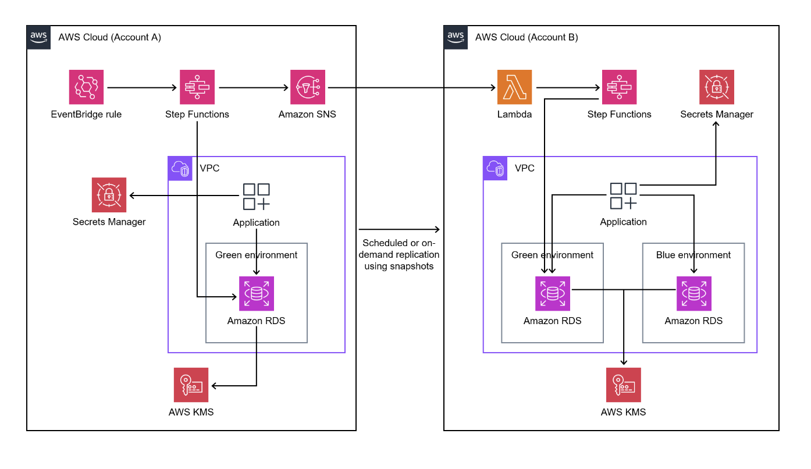

# Cross Account / Cross Environment RDS Replication

## Introduction  
This is a temporary solution to sync Prod & Dev RDS instances on a cron schedule. For simplicity, we refer to the Source account as the account with the up to date RDS instance which we would like to replicated to Account B (Destination Account) For example; if we would like our Development environment (Account B) to have the same data as our Production environment (Source Account)
#### Tech stack 
- CloudFormation templates 
  - DestinationAccountRDS.yaml relates to the account that will have the synced RDS instance at the end of this process
  - SourceAccountRDS.yaml relates to the account with the up to date RDS instance (For eg; Prod in DI ) 
- Amazon Simple Notification Service (Amazon SNS)
- AWS Key Management Service (AWS KMS)
- AWS Lambda 
- AWS Secrets Manager 
- AWS Step Functions
- Amazon Relational Database Service (Amazon RDS) 

#### Architecture diagram 

In the source account (account A in the diagram), the Step Functions state machine performs the following:

1. Creates a snapshot from the RDS DB instance in account A.

1. Copies and encrypts the snapshot with an AWS KMS key from account A. To ensure encryption in transit, the snapshot is encrypted whether or not the DB instance is encrypted.

1. Shares the DB snapshot with account B by giving account B access to the snapshot.

1. Pushes a notification to the SNS topic, and then the SNS topic invokes the Lambda function in account B.

In the destination account (account B in the diagram), the Lambda function runs the Step Functions state machine to orchestrate the following:

1. Copies the shared snapshot from account A to account B, while using the AWS KMS key from account A to decrypt the data first and then encrypt the data by using the AWS KMS key in account B.

1. Reads the secret from Secrets Manager to capture the name of the current DB instance.

1. Restores the DB instance from the snapshot with a new name and default AWS KMS key for Amazon RDS.

1. Reads the endpoint of the new database and updates the secret in Secrets Manager with the new database endpoint, and then tags the previous DB instance so that it can be deleted later.

1. Keeps the latest N instances of the databases and deletes all the other instances.

## Getting started

### Data required for Cloud Formation templates 

-   SourceDBIdentifier 
-   Source Account Number
-   Destination Account Number
-   ScheduleExpression : https://docs.aws.amazon.com/lambda/latest/dg/services-cloudwatchevents-expressions.html
-   DBInstanceClass 
-   Subnetgroups
-   DatabaseName (Destination DB name) 
These stages require some manual intervention.
-   SecretName (Just decide on a name, no need to create via console)
-   SGID (Security group ID for RDS) 

####  1) Deploy Cloud formation SourceAccountRDS.yaml template in Source Account 

Create new stack > Upload template 

Once deployment is successful, please note down ***ARN of SNS topic*** From ***Resources*** tab of CloudFormation. 
   
#### 2) Visit cloudformation in AWS console of Destination Account and deploy DestinationAccountRDS.yaml template to deploy infra. 

Create new stack > Upload template 

Once deployment is successful, please note down ***Physical ID and ARN*** of InvokeFunction Lambda from ***Resources*** tab of CloudFormation***

#### 3) Add permission on SNS to allow subscription from lambda of destination account
#### Source Account
aws sns add-permission \
--label lambda-access --aws-account-id "934596636012" \
--topic-arn "arn:aws:sns:eu-west-2:797159918096:test-source-rdssync-CrossAccountSnapshotNotificationSNSTopic" \
--action-name Subscribe ListSubscriptionsByTopic 

#### 4) Add permission on lambda to allow SNS to trigger it
#### Destination Account
aws lambda add-permission \
--function-name "test-dest-rdssync-InvokeStepFunction" \
--source-arn "arn:aws:sns:eu-west-2:797159918096:test-source-rdssync-CrossAccountSnapshotNotificationSNSTopic" \
--statement-id function-with-sns \
--action lambda:InvokeFunction \
--principal sns.amazonaws.com

### 5) Create a subscription
#### Destination Account
aws sns subscribe \
--protocol "lambda" \
--topic-arn "arn:aws:sns:eu-west-2:797159918096:test-source-rdssync-CrossAccountSnapshotNotificationSNSTopic" \
--notification-endpoint "arn:aws:lambda:eu-west-2:934596636012:function:test-dest-rdssync-InvokeStepFunction"

## Trouble shooting / Gotchas

- The RDS instance can have some downtime (~10 mins) will snapshot is being created. 

## Resources / References 

* https://docs.aws.amazon.com/prescriptive-guidance/latest/patterns/automate-the-replication-of-amazon-rds-instances-across-aws-accounts.html 

